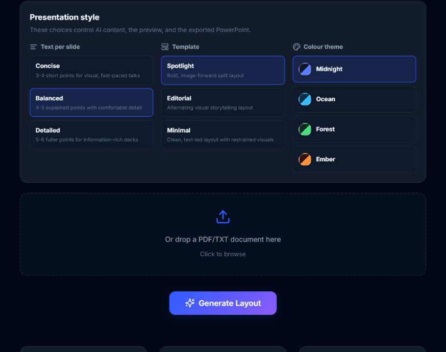
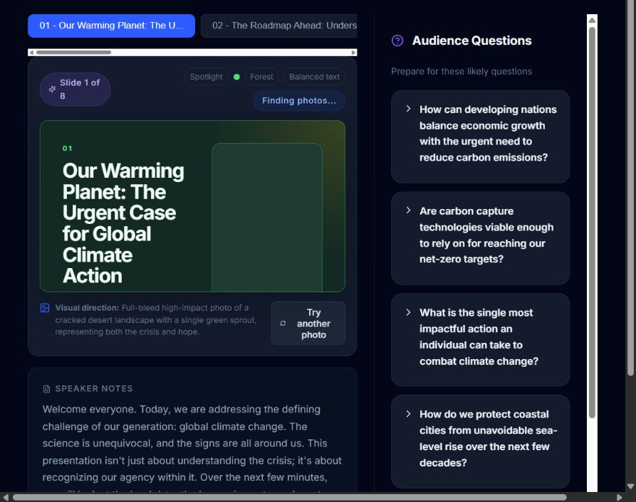
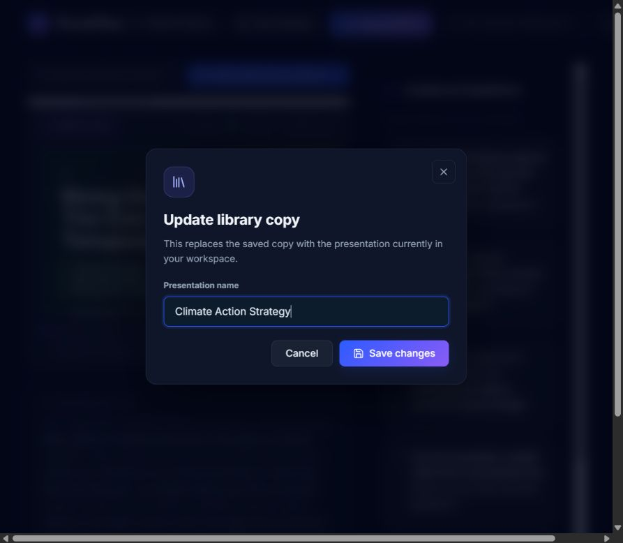
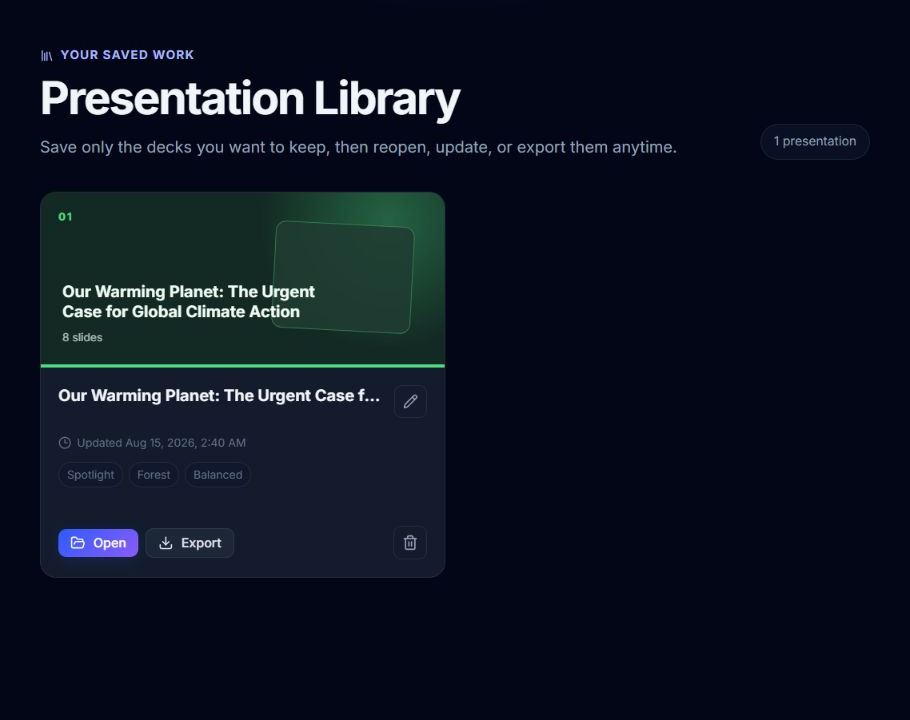
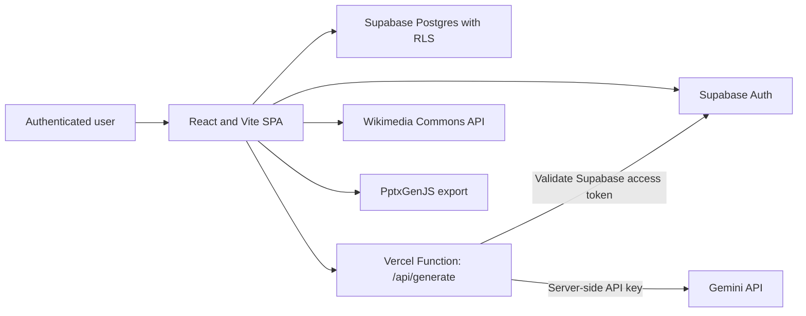

# PitchPilot

PitchPilot is an AI-assisted presentation builder that turns a topic or source document into a structured, presentation-ready PowerPoint deck. It combines Gemini-generated content, context-aware Wikimedia Commons photography, configurable visual styles, speaker notes, audience Q&A preparation, secure email authentication, and a private presentation library.

[View the live application](https://presentation-maker-ai-flax.vercel.app/)

## Product walkthrough

### Start from a topic or source document

Describe the presentation in natural language or upload a PDF/TXT document. PitchPilot uses the supplied context to create a coherent slide outline and complete deck.


### Control content density and visual direction

Choose concise, balanced, or detailed slide content; select one of three layout templates; and apply one of four colour themes. The same preferences drive AI generation, the browser preview, and the exported PowerPoint.



### Review, edit, and prepare to present

The workspace provides slide navigation, formatted key points, speaker notes, visual guidance, contextual photo controls, and expandable audience Q&A prompts. Individual slides can be revised with natural-language instructions.



### Save only the presentations you want to keep

Saving is explicit rather than automatic. A user can create or update a named library copy without changing unrelated presentations.



### Reopen and export saved work

Every account has a private library for reopening, renaming, updating, exporting, or deleting saved presentations.



## Core capabilities

- Email and password authentication through Supabase Auth
- AI-generated outlines, slide content, speaker notes, visual recommendations, and audience Q&A
- Outline refinement, slide reordering, and slide deletion before full generation
- Natural-language editing for individual generated slides
- Three content-density levels: Concise, Balanced, and Detailed
- Three presentation templates: Spotlight, Editorial, and Minimal
- Four colour themes: Midnight, Ocean, Forest, and Ember
- Topic-aware image discovery and relevance scoring with Wikimedia Commons attribution
- PDF and TXT source-document ingestion in the browser
- Client-side `.pptx` export with the selected template, theme, text density, images, and photo credits
- Optional, account-scoped presentation library backed by Supabase Postgres and Row Level Security

## Architecture



The browser owns the interactive workflow and stores the active, unsaved deck in `sessionStorage`. Supabase manages durable identity and user-owned library records. The Vercel function validates the current Supabase access token before forwarding a generation request to Gemini, so the Gemini API key is never shipped in the client bundle.

## Technology stack

| Layer | Technology | Responsibility |
| --- | --- | --- |
| Frontend | React 19, React Router 7, Vite 6 | Application UI, protected routes, workflow state, and production build |
| Authentication | Supabase Auth | Email/password registration, login, session refresh, and logout |
| Database | Supabase Postgres | Presentation persistence with per-user Row Level Security |
| AI orchestration | Vercel Node.js Function | Authenticated Gemini proxy, input validation, and response handling |
| AI model | Gemini | Outline, presentation, Q&A, speaker-note, and slide-edit generation |
| Images | Wikimedia Commons API | Licensed photo search, relevance scoring, metadata, and attribution |
| Document ingestion | PDF.js | Client-side extraction from PDF and TXT source documents |
| Export | PptxGenJS | Client-side PowerPoint generation |
| Icons | Lucide React | Interface iconography |
| Testing | Node.js test runner | Unit tests for configuration, relevance scoring, mapping, and API guards |
| Hosting | Vercel | Static frontend hosting and the protected server function |

## Request flow

1. Supabase restores or creates an authenticated email session.
2. The user supplies a topic or uploads a PDF/TXT document and chooses presentation preferences.
3. The frontend sends the prompt and Supabase access token to `POST /api/generate`.
4. The Vercel function validates the token with Supabase before calling Gemini with the server-only API key.
5. Gemini returns structured outline or slide data, which is normalized before entering application state.
6. Photo queries are derived from the deck topic, slide title, and concrete keywords. Wikimedia candidates are filtered by aspect ratio, resolution, topic coverage, and slide-specific relevance.
7. The user can refine the outline, edit slides, replace photos, review speaker notes and Q&A, export a PowerPoint, or explicitly save the deck.
8. Saved presentations are written directly to Supabase under Row Level Security policies tied to `auth.uid()`.

## Repository structure

```text
.
|-- api/
|   `-- generate.js               # Authenticated Gemini Vercel function
|-- docs/screenshots/             # Live product screenshots used in this README
|-- src/
|   |-- components/               # Shared authentication, navigation, and option controls
|   |-- config/                    # Templates, themes, density settings, and normalization
|   |-- context/                   # Supabase authentication context
|   |-- screens/                   # Login, input, outline, workspace, and library screens
|   `-- services/                  # AI, Supabase, image, document, library, and PPTX services
|-- supabase/
|   `-- schema.sql                 # Presentation table, trigger, grants, and RLS policies
|-- tests/                         # Frontend and Vercel-function unit tests
|-- services/                      # Legacy/reference FastAPI service implementations
|-- vercel.json                    # Function and SPA routing configuration
`-- vite.config.js                 # Vite and chunk configuration
```

## Local development

### Prerequisites

- Node.js 20 or later
- pnpm
- A Supabase project
- A Gemini API key

### Installation

```bash
git clone https://github.com/Abhigyan-git09/presentationMakerAI.git
cd presentationMakerAI
pnpm install
```

Copy the environment template:

```bash
cp .env.example .env.local
```

On PowerShell:

```powershell
Copy-Item .env.example .env.local
```

Set the required values in `.env.local`:

```env
VITE_SUPABASE_URL=https://your-project-id.supabase.co
VITE_SUPABASE_PUBLISHABLE_KEY=sb_publishable_your_key
GEMINI_API_KEY=your_server_only_gemini_key
GEMINI_MODEL=gemini-3.5-flash
```

Run the Vercel-compatible development server so both the SPA and `/api/generate` are available:

```bash
pnpm dlx vercel dev
```

`pnpm dev` starts only the Vite frontend. Authentication and the Supabase library still work, but Gemini generation requires the Vercel function or an equivalent local proxy.

## Supabase setup

1. Create a Supabase project.
2. Enable the Email provider under **Authentication > Providers**.
3. Open the SQL Editor and run [`supabase/schema.sql`](supabase/schema.sql).
4. Under **Authentication > URL Configuration**, set the deployed Vercel domain as the Site URL.
5. Add the deployed URL and local development URLs to the redirect allow list.

Recommended redirect entries:

```text
https://your-project.vercel.app/**
http://localhost:3000/**
http://localhost:5173/**
http://127.0.0.1:4173/**
```

The public Supabase publishable key is intended for browser use. Database access remains protected by the policies in `supabase/schema.sql`. Never expose a Supabase secret/service-role key in the frontend.

## Environment variables

| Variable | Scope | Required | Description |
| --- | --- | --- | --- |
| `VITE_SUPABASE_URL` | Browser and server function | Yes | Supabase project URL |
| `VITE_SUPABASE_PUBLISHABLE_KEY` | Browser and server function | Yes | Public Supabase key used with Auth and RLS |
| `GEMINI_API_KEY` | Server function only | Yes | Gemini API key; must not use a `VITE_` prefix |
| `GEMINI_MODEL` | Server function only | No | Gemini model identifier; defaults to `gemini-3.5-flash` |

## Available scripts

| Command | Purpose |
| --- | --- |
| `pnpm dev` | Start the Vite frontend development server |
| `pnpm dlx vercel dev` | Start the full frontend and server-function environment |
| `pnpm test` | Run the JavaScript unit test suite |
| `pnpm run build` | Create the production Vite build |
| `pnpm preview` | Preview the generated `dist` directory |

## Testing

```bash
pnpm test
pnpm run build
```

The main test suite covers presentation-option normalization, formatted bullet handling, image query construction and relevance thresholds, Supabase row mapping, and unauthenticated API guards.

## Deployment

1. Import this GitHub repository into Vercel.
2. Select the Vite framework preset.
3. Use `pnpm run build` as the build command and `dist` as the output directory.
4. Add all four environment variables listed above. Apply them to Production, Preview, and Development as appropriate.
5. Deploy the project.
6. Add the resulting production URL to the Supabase Site URL and redirect allow list.
7. Redeploy after any environment-variable change.

## Security model

- Gemini credentials remain server-side inside the Vercel function environment.
- Every AI request requires a valid Supabase bearer token.
- Prompt and system-instruction sizes are bounded before upstream requests are sent.
- Supabase Row Level Security restricts presentation reads and writes to the owning user.
- The browser never receives a Supabase secret/service-role key.
- Local `.env` and `.env.local` files are ignored by Git.
- Wikimedia creator, licence, and source metadata are retained in the workspace and exported deck.

## Legacy services

`services/auth-service` and `services/presentation-service` are retained as reference implementations from earlier backend iterations. The production deployment uses Supabase Auth, Supabase Postgres, and `api/generate.js`; the legacy FastAPI services are not required by the Vercel deployment.
